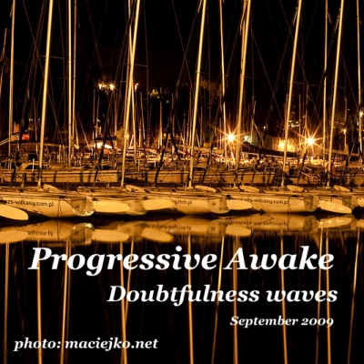

# Doubtfulness Waves (September 2009)

----

Date: 2009-09-05    
Tags: progressive house    

  

* [**Mixcloud**](https://www.mixcloud.com/progressiveawake2010/doubtfulness-waves-september-2009/)
* [**Download MP3 (88MB, 64min)**](https://1drv.ms/u/s!Alo3H0XlzdZxgR9NFbrQLg9AzsLF?e=vVKTHN)  

TRACKLIST:  

* christian weber – electronic love (club mix)
* hybrid – finished symphony (deadmau5 remix)
* starchaser – a new society (thomas schwartz & fausto fanizza vocal mix)
* uwe worlitzer – fly with me (vids remix)
* joanna – sometimes (matt cerf dub mix)
* max linen – neon lights (thomas schwartz rmx)
* khomha – better of alone 2009 (sunrise mix)
* dj tatana ft. florian – soulmate (dinka vocal mix)
* fuzzy hair – be free (thomas schwartz mix)
* feel, tiff lacey, alexander popov – time after time (chris reece main mix)
* luciano di nardo – anymore (chris reece remix)
* johnny & peps – aqua (original mix)

All tracks are available to buy on <a href="http://beatport.com" target="_blank">Beatport</a>.
Enjoy.

----

[**BACK TO MAIN PAGE**](./README.md)

---- 
