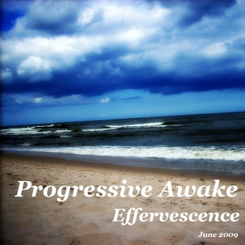

# Effervescence (June 2009)

----

Date: 2009-06-26    
Tags: progressive house    

* [**Listen on MIXCLOUD**](https://www.mixcloud.com/progressiveawake2010/effervescence-june-2009/)
* [**Download MP3 (56MB, 60min)**](https://1drv.ms/u/s!Alo3H0XlzdZxgShv5OMx6gv4Jevn?e=wJ5PwN)  

TRACKLIST:  

* starchaser – a new society (thomas schwartz & fausto fanizza vocal mix)
* thomas schwartz, fausto fanizza – jambe myth (original mix)
* luciano di nardo – anymore (chris reece remix)
* johnson, haske – breeze (original mix)
* glenn morrison – no sudden moves (original mix)
* radio k ft. randy roberts – coming (chris reece remix)
* daniel portman – open your mind (dinka deep remix)
* rick costa – broken box (original mix)
* niklas gustavsson – ripple (original mix)
* dj tatana – somebody (leventina remix)
* max linen – neon lights (thomas schwartz rmx)
* dj tatana ft. florian – soulmate  (dinka vocal mix)

All tracks are available to buy on <a href="http://beatport.com" target="_blank">Beatport</a>.
Enjoy.

----

[**BACK TO MAIN PAGE**](./README.md)

---- 
