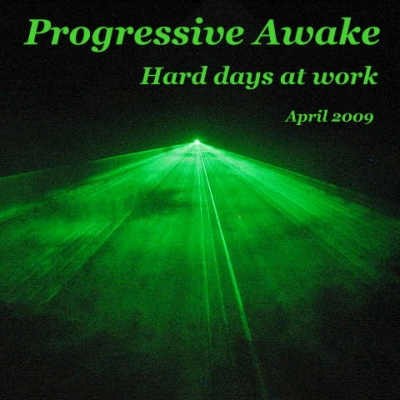

# Hard days at work (April 2009)

----

Date: *2009-04-23*
Tags: *#progressive house*, *#tech house*, *#techno*  

  

### Description

Dive into the vibes of April 2009 with this electrifying DJ set recorded right from the comfort of home! This mix is the 9th installment in the Progressive Awake series, promising a journey through pulsating beats and immersive soundscapes. Let the rhythms take you on a memorable ride!

### Listen and watch on...

* [**YOUTUBE**](https://youtu.be/QF_UXuIfPmU)   

TRACKLIST:  

* 00:00 inkfish, dawid west - hello piano (sebastien leger remix)
  /[_YouTube_](https://www.youtube.com/watch?v=osh5xBfBatg),[_Beatport_](https://www.beatport.com/track/hello-piano/676755)/  
* 07:20 thomas schwartz, fausto fanizza - jambe myth (original mix)
  /[_YouTube_](https://www.youtube.com/watch?v=XZYZ8w6XPBY),[_Beatport_](FIXMEhttps://www.beatport.com/track/jambe-mith/1135616)/  
* 13:23 mark knight, adam k, soha - from the speaker (original dub mix)
  /[_YouTube_](https://www.youtube.com/watch?v=fM7FlBDAeDs),[_Beatport_](https://www.beatport.com/track/from-the-speaker/609206)/  
* 19:54 manibeat - muzikita (the kzr remix)
* 24:39 ogi gee cash, dimiz - 4things (original mix)
  /[_YouTube_](https://www.youtube.com/watch?v=k5MIUU7bLnk),[_Beatport_](https://www.beatport.com/track/4things/707858)/  
* 30:25 marco petralia - just believe (original mix)
  /[_YouTube_](https://www.youtube.com/watch?v=0xXGVNp7Y44),[_Beatport_](https://www.beatport.com/track/just-believe/250729)/  
* 34:32 alex tepper - grains (original mix)
  /[_YouTube_](https://www.youtube.com/watch?v=16aeYbW14io)/  
* 42:40 ryan davis - clouds passing by (eelke kleijn rmx)
  /[_YouTube_](https://www.youtube.com/watch?v=7Ql_K-dpX2g),[_Beatport_](https://www.beatport.com/track/clouds-passing-by/654595)/  
* 49:28 16 bit lolitas - murder weapon (original mix)
  /[_YouTube_](https://www.youtube.com/watch?v=sF50fc7Zh5E),[_Beatport_](https://www.beatport.com/track/murder-weapon/724204)/  
* 56:58 jhonny & peps, squid - all in all out (original mix)
  /[_Beatport_](https://www.beatport.com/track/all-in-all-out/771990)/  

All tracks are available to buy on <a href="http://beatport.com" target="_blank">Beatport</a>.  
If you like what I am creating then feel free to support me on [Patreon](https://www.patreon.com/shivioua) or [buy me a vinyl](https://www.buymeacoffee.com/shivioua).  
Enjoy!  

----

[**BACK TO MAIN PAGE**](./README.md)

---- 
