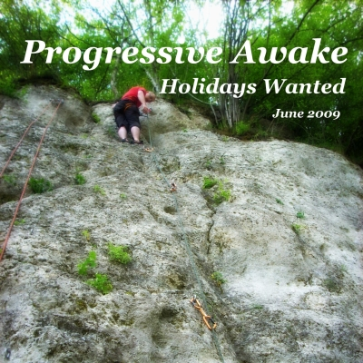

# Holidays Wanted!!! (June 2009)

----

Date: *2009-06-14*  
Tags: *#progressive house*, *#progressive trance*      

### Description

Step into mid-June 2009 with this DJ mix, recorded just after the Lobotomia party and on the cusp of much-needed summer break plans. With work and studies piling up, creating this set became a release — a way to breathe, reset, and escape from the rush of daily responsibilities. As the 11th mix in the Progressive Awake series, it’s filled with immersive progressive house and trance beats, designed to transport you and offer a moment of pure detachment.

### Listen on

* [**YOUTUBE**](https://youtu.be/8Utd1gg3zlM)  

<!-- 
[**Download MP3 (49MB, 53min)**](https://1drv.ms/u/s!Alo3H0XlzdZxgTvckXSa7o0rIdw4?e=eT3Ial)  
-->

### Tracklist

Most of the tracks are available to buy on <a href="http://beatport.com" target="_blank">Beatport</a>.  

TRACKLIST:  

* 00:00 radio k ft. randy roberts - coming (chris reece remix)   
* 04:27 max linen - neon lights (thomas schwartz rmx)  
* 09:27 kaskade - 4 am (adam k & soha dub)  
* 14:05 adam k, soha - long distance (original mix)  
* 20:16 luciano di nardo - anymore (chris reece remix)  
* 25:40 daniel portman - open your mind (dinka deep remix)  
* 31:40 dj tatana - somebody (leventina remix)  
* 35:24 dj tatana ft. florian - soulmate (dinka vocal mix)  
* 41:22 dj tatana - spring breeze (martin roth summer style remix)  
* 45:55 inkfish, dawid west - hello piano (sebastien leger remix)  

If you like what I am creating then feel free to support me on [Patreon](https://www.patreon.com/shivioua) or [buy me a vinyl](https://www.buymeacoffee.com/shivioua).  
Enjoy!  

----

[**BACK TO MAIN PAGE**](./README.md)

---- 
