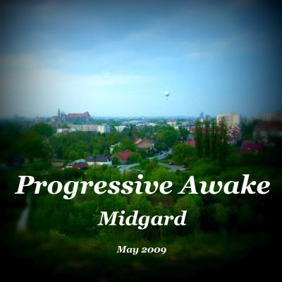

# Midgard (May 2009)

----

Date: *2009-05-16*  
Tags: *#progressive house*, *#tech house*  

<!-- FIXME: YT link instead of Mixcloud -->
  

### Description

Step into the vibe of May 2009 with this DJ mix inspired by an unforgettable trip to Krakow with friends. From the historic streets of Kazimierz to a bonfire by Zakrzówek's waters, and a great night at Midgard club, where After Sky set the tone — these moments shaped the energy of this mix. 

This is the 10th installment of the Progressive Awake series, it takes you on a journey through progressive house and tech house, blending deep, pulsating beats with the echoes of those vibrant experiences.  

### Listen On

* [**YOUTUBE**](https://youtu.be/x03URnCK6Ss)  
* [**MIXCLOUD**](https://www.mixcloud.com/progressiveawake/midgard-may-2009/)

<!-- 
* [**Download MP3 (60MB)**](https://1drv.ms/u/s!AmzuuXrjf51v2LJImImzUwMnG3KUBA?e=ocnq6L)
-->

### Tracklist

Most of the tracks are available to buy on <a href="http://beatport.com" target="_blank">Beatport</a>.  

* niklas gustavsson – ripple (original mix)
* dinka – chemistry (original mix)
* inkfish, dawid west – hello piano (sebastien leger remix)
* sebastien leger – majuro (original mix)
* mark knight, adam k, soha – from the speaker
* glenn morrison – no sudden moves (original mix)
* daniel portman – open your mind (dinka deep remix)
* hybrid – finished symphony (deadmau5 remix)
* deadmau5 – not exactly
* mossy – it works (original mix)
* coco fay – hold you back (muzzaik remix)
* joanna – sometimes (matt cerf dub mix)

If you like what I am creating then feel free to support me on [Patreon](https://www.patreon.com/shivioua) or [buy me a vinyl](https://www.buymeacoffee.com/shivioua).  
Enjoy!  

----

[**BACK TO MAIN PAGE**](./README.md)

---- 
