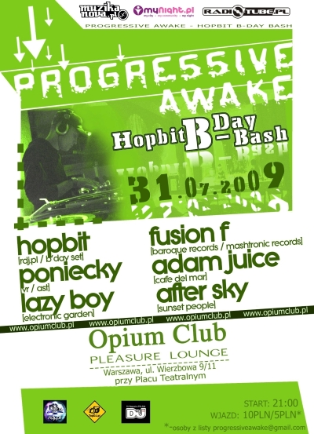

# Opium (July 2009)

----

Date: 2009-07-31    
Genres: **#progressive**, **#tech**, **#house**, **#trance**

### Listen on

* [**MIXCLOUD**](https://www.mixcloud.com/progressiveawake2010/opium-july-2009/)
<!--* [**Download MP3**](https://1drv.ms/u/s!Alo3H0XlzdZxgUsgOC46xPQcvmr3?e=4f3XSb)  -->

### Description  

Some moments stay with you not because they were perfect, but because they meant something.

This mix was recorded live during the very first **Progressive Awake** event at **Club Opium** in Warsaw, at the end of July 2009.

For a long time, I had dreamed of organizing my own club night—bringing together friends behind the decks, inviting an artist whose music I admired, and creating an atmosphere built around the sound I truly loved: deep, melodic and non-commercial progressive house.

In many ways, this event became a gift to myself and the culmination of more than a year of building the Progressive Awake project.

Joining me that night were **Poniecky, Lazy Boy, After Sky** and **Fusion F**, each contributing to a musical journey that flowed naturally from start to finish. Although attendance wasn't what I had hoped for, the people who were there, the music we shared and the energy of the evening made it an unforgettable experience.

Listening back today, I don't hear just another DJ set - I hear the excitement, anticipation and satisfaction of seeing a personal dream become reality.

Enjoy the journey.

### TRACKLIST 🎶  

* 00:00 radio k ft. randy roberts - coming (chris reece remix)
* 04:17 joanna - sometimes (matt cerf dub mix)
* 10:45 luciano di nardo - anymore (chris reece remix)
* 16:51 dj tatana ft. florian - soulmate (dinka vocal mix)
* 23:26 starchaser - a new society (thomas schwartz mix)
* 28:02 kidro – anybody out there (thomas schwartz mix)
* 32:19 max linen – neon lights (thomas schwartz rmx)
* 36:40 kaskade - 4 am (adam k & soha dub)
* 40:24 mark knight, adam k, soha - from the speaker (original dub mix)
* 46:37 inkfish, dawid west - hello piano (sebastien leger remix)
* 53:30 glenn morrison – no sudden moves (original mix)

----

[**BACK TO MAIN PAGE**](./README.md)

---- 
