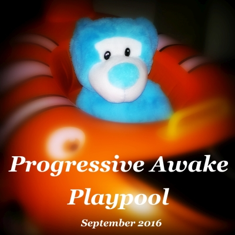

# Playpool (September 2016)  

----

Date: 2016-09-25    
Tags: dance, progressive house, vocal    

  
* [**Listen on MIXCLOUD**](http://www.mixcloud.com/progressiveawake/playpool-september-2016/)  
* [**Listen on SOUNDCLOUD**](https://soundcloud.com/progressive-awake/playpool-september-2016/)  
* [**Download MP3**](https://1drv.ms/u/s!Alo3H0XlzdZxgW9fRhK6BaRHljuX?e=bDamuY)  
  
TRACKLIST:  

01. chillion ft. seren - wicked game   
02. cj stone - shining star (original mix)  
03. eric prydz pres. pryda - shadows (original mix)  
04. ian dee grees - backspace (source one filter mix)  
05. michael mind - show me love (gap 4 rmx)  
06. stfu - urgent (club mix)  
07. whigfield - right in the night (favretto & battini remix extended)  
08. stefy de cicco - i wanna walk (to the rythm of your heart) (original mix)  
09. jasper forks - river flows in you (club mix)  

Enjoy & support artists by [buying their music](http://beatport.com)!

----

[**BACK TO MAIN PAGE**](./README.md)

---- 
