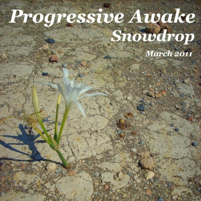

# Snowdrop (March 2011)

----

Date: 2011-03-05  
Tags: break beat, progressive house, tech house, trance  

* [**Listen on MIXCLOUD**](https://www.mixcloud.com/progressiveawake2010/snowdrop-march-2011/)
* [**DOWNLOAD LINK (97MB, 1h 8min)**](https://1drv.ms/u/s!Alo3H0XlzdZxgX9H-R2X1IPZIWsx?e=6qZHHT)

TRACKLIST:

* cinnamon chasers – two hours time (remix)
* flight facilities ft. giselle – crave you (version 2)
* cinnamon chasers – tattoo (original mix)
* fusion f, come t – begin now (original mix)
* adam k ft. naan – wake up (club mix)
* matt cerf, jaren, eric meza – with me (passive progressive remix)
* fatblock – take a picture (original vocal mix)
* edx – embrace (original club mix)
* dinka, george f. zimmer – soma is language (original mix)
* dinka – never cheat on strangers (original mix)
* matteo marini – connected (original mix)
* proff – we show it (chris reece prog remix)
* edx – hoover (adam k remix)

All tracks are available to buy on <a href="http://beatport.com" target="_blank">Beatport</a>.
Enjoy!

----

[**BACK TO MAIN PAGE**](./README.md)