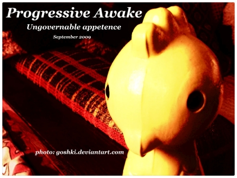

# Ungovernable Appetence 
## (Semptember 2009)

----

Date: 2009-09-04    
Tags: progressive house, tech house, techno    

* [**Listen on MIXCLOUD (66 min)**](https://www.mixcloud.com/progressiveawake/ungovernable-appetence-september-2009/) 
* [**Download MP3 (92MB)**](https://1drv.ms/u/s!AmzuuXrjf51v2LJhVcfSiEq37DcqfA?e=NxTpkX) 
  
TRACKLIST:  

* manuel de la mare – sunrise (original mix)
* johnson, haske – breeze (original mix)
* daniel portman – dark is the night for all (original mix)
* daniel portman – open your mind (dinka deep remix)
* double d ft. brainstorm – musica electronika (melt’s edit)
* ogi gee cash, dimiz – 4things (original mix)
* dinka – canonball (original mix)
* alex del amo – the awakening (original mix)
* feel, tiff lacey, alexander popov – time after time (chris reece main mix)
* christian weber – electronic love (club mix)
* starchaser – a new society (thomas schwartz & fausto fanizza vocal mix)
* khomha – better of alone 2009 (sunrise mix)

All tracks are available to buy on <a href="http://beatport.com" target="_blank">Beatport</a>.
Enjoy.